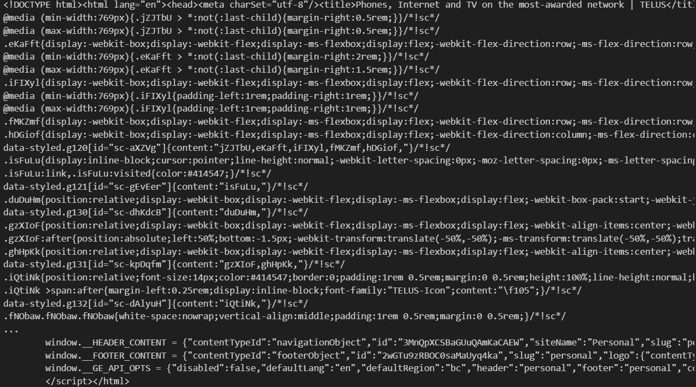

# 網路爬蟲學習之路

小的我將透過網路上其他作者之教學進行應用以及學習，有興趣的人可以去看看其他人的文章，其中會應用到基本的 **Request**以及**beautiful soup**等地應用，有興趣的人可以參考最下面的網址~

## 所需要的Package安裝

```python
#普遍Request在安裝Python時就已經存在~
pip install Request
pip install bs4
```
這邊主要是應用**Request**以及**bs4**中的**beautiful soup**所以我們先安裝上述2個**Package**。
## 基本的應用Request撈取資料
```python
import requests
#放置想要爬取的網址位置
url = 'https://tw.news.yahoo.com/'
#取得結果
response = requests.get(url)
```
那我們透過request的方式去存取網頁上的所有資料，在這邊並未應用**bs4**去處理，然後下面是呈現撈取的結果，先確認HTTP狀態碼是否為成功，如果不成功就呈現失敗的訊息**Failed to retrieve the webpage**，如果撈取正常我們將看到整個網頁的架構程式碼。
```python
if response.status_code == 200:
    print(response.text)
else:
    print('Failed to retrieve the webpage')
```

## bs4的應用 (撈取PTT)
學會基本的**Request**資料撈取接下來我們開始應用**beautiful soup**來存取以及清洗想要的資料，這邊的話根據網路上相關的範例，製作PPT撈取的程式。
```python
from bs4 import BeautifulSoup
import requests

# 請求獲取網頁內容
my_headers = {'cookie': 'over18=1;'}
url = 'https://www.ptt.cc/bbs/Gossiping/index.html'
response = requests.get(url,headers=my_headers)
```
這邊的話我們一樣會應用**Request**的方式去存取內容後，由於PTT有年齡限制問題，所以我們加上**Cookie**讓它在判斷的時候=1，也就代表是否滿18歲的"是"。
```python
if response.status_code == 200:
    # 使用 BeautifulSoup 整理
    soup = BeautifulSoup(response.text, 'html.parser')

    # 找標題
    title = soup.title
    print("Title:", title.text)

    # 找所有的連結
    links = soup.find_all('a')
    print("Links:")
    for link in links:
        print(link.get('href'))

    # 找段落的內文
    paragraphs = soup.find_all('p')
    print("Paragraphs:")
    for paragraph in paragraphs:
        print(paragraph.text)
else:
    print('Failed to retrieve the webpage')
```
在這個部分我們加入了**beautiful soup**來找自己想要的部分，如：標題、超連結、段落內文等，一開始一樣去判斷是否正常，正常後透過**soup**的功能去找尋網頁的相關部分並列印出來。

## 爬取其他PPT頁面的文章
接下來是延伸的部分，可以去利用迴圈的方式撈取其他頁面的資料，並將資料分別存取於不同的變數中。這邊主要將上面所學的部分建立成**Function**，在最後的時候用迴圈的方式爬取以及選取資料。
```python
#第一部分
import requests
from bs4 import BeautifulSoup

def get_resp(url):
    cookies = {
        'over18': '1'
    }
    resp = requests.get(url, cookies=cookies)
    if resp.status_code != 200:
        return 'error'
    else:
        return resp
```
第一個部分一樣是應用Request去爬取網頁的資料，但有少部分的更改，加入了判斷式主要是因為後續要放入迴圈內，所以改成**function**的方式去撰寫。
```python
#第二部分
def get_articles(resp):
    soup = BeautifulSoup(resp.text, 'html5lib')
    arts = soup.find_all('div', class_='r-ent')
    for art in arts:
        title = art.find('div', class_='title').getText().strip()
        if not title.startswith('(被刪除了QQ)'):
            link = 'https://www.ptt.cc' + \
                art.find('div', class_='title').a['href'].strip()
        author = art.find('div', class_='author').getText().strip()
        print(f'title: {title}\nlink: {link}\nauthor: {author}')
    # 利用 Css Selector 找下一頁網址
    next_url = 'https://www.ptt.cc' + \
        soup.select_one(
            '#action-bar-container > div > div.btn-group.btn-group-paging > a:nth-child(2)')['href']
    return next_url
```
首先，用迴圈的方式找尋頁面的文章，發現這些文章都放在**class = r-ent**之中，所以我們去查找全部的**r-ent**，然後用迴圈的方式將文章的標題、網址、作者都給存取下來，這邊的話多了一個**IF**是用來判斷文章是否被刪除了 (就說不能壞壞會被抓) ，再來的話就是跳到下一頁的部分，我們透過檢視程式碼的方式能夠發現跳轉至下一頁的方式是放置在#action-bar-container > div > div.btn-group.btn-group-paging > a:nth-child(2)')['href']之下，可以透過**F12**查看網頁下的相關位置，並點選右鍵複製**Copy selector**將該位置貼上找到這個位置。
## 執行並爬取~
```python
if __name__ == '__main__':
    # 第一個頁面網址
    url = 'https://www.ptt.cc/bbs/Gossiping/index.html'
    # 先讓爬蟲爬 10 頁
    for now_page_number in range(10):
        resp = get_resp(url)
        if resp != 'error':
            url = get_articles(resp)
        print(f'======={now_page_number+1}/10=======')
```
透過上述的**function**我們能夠去爬取想要的頁數，只要更改**range**的部分就可以了，透過!=的方式去判斷爬取的狀況是否正常，最後印出爬取的部分就完工羅~


# 參考文章
* [Python手把手爬取 PPT 八卦版最新話題！](https://medium.com/marketingdatascience/python%E6%89%8B%E6%8A%8A%E6%89%8B%E7%88%AC%E5%8F%96-ppt-%E5%85%AB%E5%8D%A6%E7%89%88%E6%9C%80%E6%96%B0%E8%A9%B1%E9%A1%8C-%E5%90%AB%E7%A8%8B%E5%BC%8F%E7%A2%BC-6f46c2d3f746)
* [Python手把手爬取 PPT 八卦版最新話題！Youtube影片](https://www.youtube.com/watch?v=yeY1LFHdZs4&ab_channel=zinolin)
* [[技術筆記] Python x BS4 網頁爬蟲— 爬取 Ptt Stock 版多頁文章](https://alisonhsu1106.medium.com/python-x-beautifulsoup-%E7%B6%B2%E9%A0%81%E7%88%AC%E8%9F%B2-%E7%88%AC%E5%8F%96-ptt-stock-%E7%89%88%E5%A4%9A%E9%A0%81%E6%96%87%E7%AB%A0-6a2fb34acbfa)
